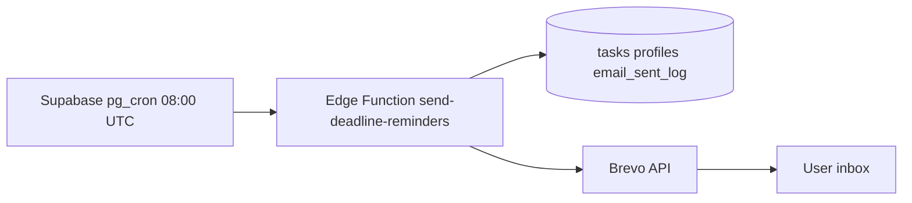

# Phase 2: Email deadline reminders (Brevo)

**Status:** Implemented — see [BREVO_EMAIL_SETUP.md](./BREVO_EMAIL_SETUP.md) for deployment steps.

## Goal

Send one daily digest per user listing overdue, due-today, and due-tomorrow tasks assigned to them.

## Architecture

## Components

| Piece | Location |
|-------|----------|
| Edge Function | `supabase/functions/send-deadline-reminders/index.ts` |
| Idempotency table | `supabase/migrations/20260715_email_digest_brevo.sql` |
| Cron schedule | `supabase/sql/schedule_email_digest_cron.sql` |
| Setup guide | `docs/BREVO_EMAIL_SETUP.md` |

## Why Brevo

- 300 emails/day free tier (vs Resend 100/day)
- Simple REST API from Edge Functions
- Works well for cohort-scale daily digests

## Secrets (Supabase Edge Function)

| Variable | Purpose |
|----------|---------|
| `BREVO_API_KEY` | Brevo transactional API key |
| `BREVO_SENDER_EMAIL` | Verified sender in Brevo |
| `BREVO_SENDER_NAME` | Display name (optional) |
| `CRON_SECRET` | Auth for cron + manual test calls |
| `APP_URL` | CTA link in digest email |

## Email content

**Subject:** `Cohort PM: N due today, M overdue`

**Sections:** Overdue | Due today | Due tomorrow

**CTA:** `https://pm-joes9987.vercel.app/dashboard?filter=mine`
