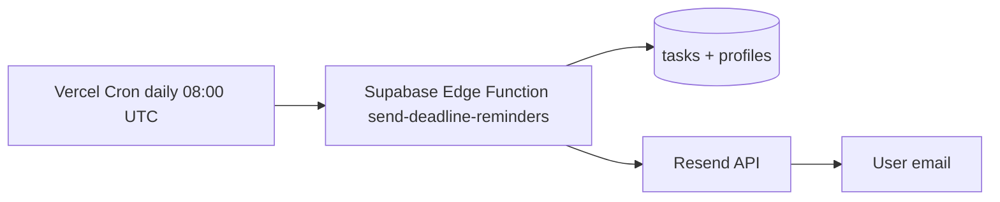

# Phase 2: Email deadline reminders (backlog)

In-app motivation features ship in Phase 1. Email digests are planned as a follow-up PR.

## Goal

Send one daily digest per user listing overdue, due-today, and due-tomorrow tasks assigned to them.

## Proposed architecture

## Implementation checklist

1. **Resend account** — create API key; add `RESEND_API_KEY` to Vercel + Supabase secrets.
2. **Edge Function** — `supabase/functions/send-deadline-reminders/index.ts`:
   - Query open tasks grouped by assignee email
   - Sections: Overdue | Due today | Due tomorrow
   - CTA: `https://pm-joes9987.vercel.app/dashboard?filter=mine`
3. **Idempotency** — add `email_sent_log` table or store `last_digest_sent_at` on profiles to avoid duplicate daily sends.
4. **Cron** — Vercel `vercel.json` cron hitting the function with `CRON_SECRET` header.
5. **Auth** — function uses service role key; never expose in client.

## Environment variables

| Variable | Where |
|----------|-------|
| `RESEND_API_KEY` | Vercel, Supabase Edge Function |
| `CRON_SECRET` | Vercel cron config, Edge Function |
| `SUPABASE_SERVICE_ROLE_KEY` | Edge Function only |

## Email template (draft)

**Subject:** You have {n} tasks due today — Cohort PM

**Body:**
- Overdue (red list)
- Due today
- Due tomorrow
- Button: Open my dashboard

## Out of scope for Phase 2 MVP

- Per-assignment instant email (in-app bell covers this)
- SMS or push notifications
- User-configurable reminder preferences

## Apply Phase 1 schema first

Run `supabase/migrations/20260715_motivation_features.sql` in the Supabase SQL editor before deploying Phase 1 UI changes.
